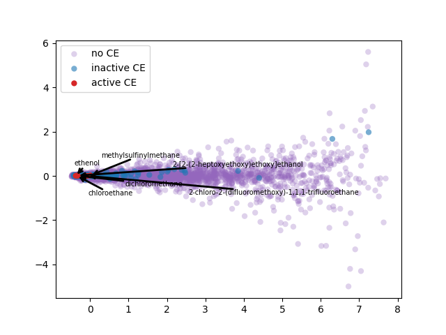
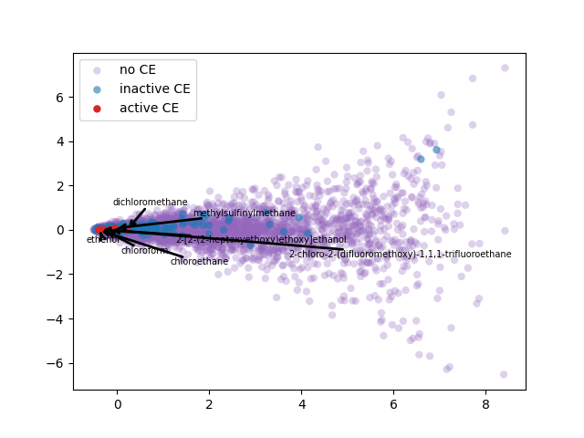
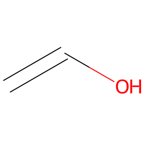

# sarscov2vec

Realize [Elton et al.](https://arxiv.org/pdf/1903.00415.pdf) pipeline using [Mekni et al.](https://www.mdpi.com/1422-0067/22/14/7714) SARS-CoV-2 viral protease SVM on PubMed Central PMC Open Access articles.


## scheme
<p align="center">
  
&nbsp; &nbsp; &nbsp; &nbsp;
  
</p>


## project 
<p align="center">
  
&nbsp; &nbsp; &nbsp; &nbsp;
  
</p>

ChemDataExtractor is used to identify Chemical Entities validate using PubChemPy and PaDEL-Descriptor software to extract compunds descriptors.  

## description

2-d PCA is used to plot word2vec results following Elton et al. pipeline. 
Moreover, as different approach, elbow method to select optimal out PCA dimension is followed and incremental K-means is applied.

## design

Strategy pattern is followed to dynamically change behavior on different load/store strategies and classifiers. 


## usage
```console
foo@bar:~/project$ ./build.sh
...
# start padel container
foo@bar:~/project$ ./padel-service/padel-service.sh 
...
# start mongo docker container
foo@bar:~/project$ ./mongo-dock.sh
...
# start project
foo@bar:~/project$ python3 sarscov2vec.py
...

```

Optionally is possible to remove lines in [code/mainProject.py](code/mainProject.py) (commented with "delete this to use FS") to disable usage of MongoDB and use file system to store chemical entities and sentences.
In this case skip start mongo docker container command.


## results

### pca 2-d

PCA 2-d results coloring active compunds against SARS-CoV-2 viral protease.


<table>
  <tr>
    <td></td>
    <td></td>
  </tr> 
  <tr>
      <td></td>
      <td></td>
  </tr>
  <tr>
     <td></td>
     <td></td>   
  </tr>
</table>

### optimal PCA out and K-MEANS


<p align="center">
  
&nbsp; &nbsp; &nbsp; &nbsp;
  
</p>

| Cluster Num.      | active CE | CE | words |
| ----------- | ----------- | ----------- | ----------- |
| 0           | 15          | 989         | 89879       |
| 1           | 1           | 92          | 4370        |
| 2           | 0           | 9           | 1272        |


| Coeff.      | value |
| ------------- | ----------- |
| silhouette avg| 0.8479288100264025|
| SSE (k=3)     | 2390           |


| **Term** | t0 | t1 | t2 | t3 | t4 | t5 | t6 | t7 | t8 | t9 |
| - | - | - | - | - | - | - | - | - | - | - |
| **covid-19** | ill | psychiatric | hiv-positive | dementia | pandemic | concern | pertain | hemophilia | people | behaviour |

### identified active fragments

<table>

  <tr>
    <td valign="top"></td>
    <td valign="top"></td>
    <td valign="top"></td>
  </tr>
   <tr>
    <td valign="top"></td>
    <td valign="top"></td>
    <td valign="top"></td>
  </tr>
     <tr>
    <td valign="top"></td>
    <td valign="top"></td>
    <td valign="top"></td>
  </tr>
 </table>
